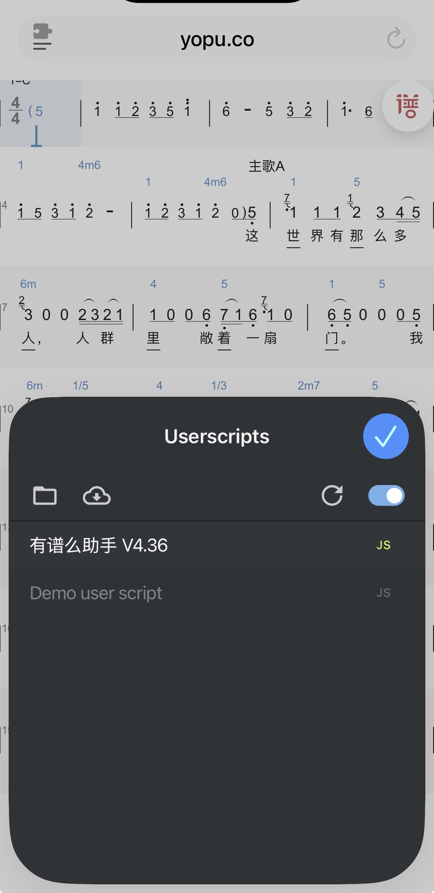
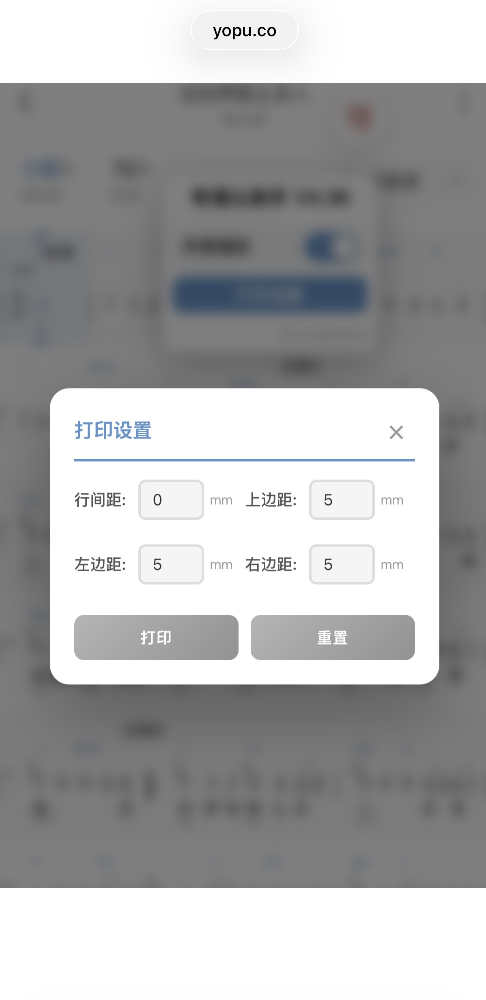
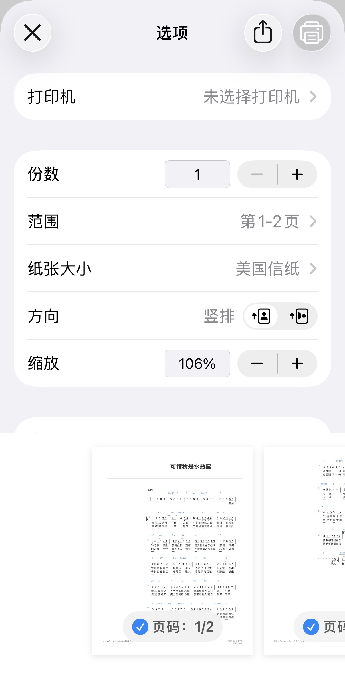
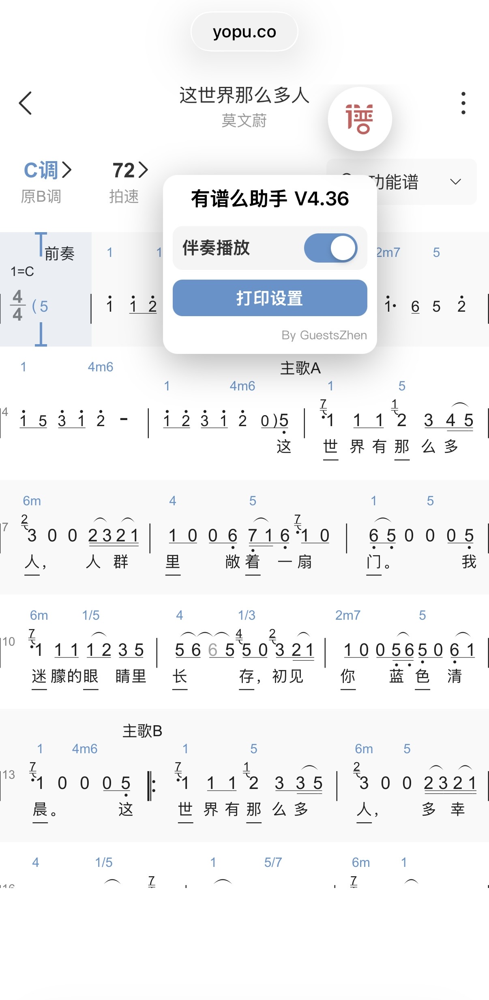

# 有谱么助手 V4.36

一款专为 [有谱么](https://yopu.co) 网站设计的浏览器用户脚本，提供优化的打印功能和伴奏播放控制。

## 功能特性

### 1. 播放解锁
- 一键解锁乐谱播放限制
- 自动记忆解锁状态
- 实时状态显示（开关样式）

### 2. 优化打印
- 使用 iframe 隔离打印，确保跨浏览器兼容性
- 支持自定义打印设置：
  - 行间距（0-20mm）
  - 上边距（5-40mm）
  - 左边距（5-40mm）
  - 右边距（5-40mm）
- 自动提取乐谱标题和歌曲信息
- 智能 SVG 渲染优化

### 3. 用户界面
- 圆形图标按钮，简洁美观
- 拖拽定位功能
- 平滑动画效果
- 设置面板一键展开/收起

## 安装要求

### 浏览器扩展
- **Tampermonkey** (推荐 v5.4.1+)
- **Userscripts** (iOS Safari 专用)

### 支持平台

| 平台 | 浏览器 | 扩展版本 | 测试状态 |
|------|--------|----------|----------|
| macOS 15 | Chrome 148+ | Tampermonkey 5.4.1 | ✅ 已测试 |
| macOS 15 | Edge 148+ | Tampermonkey 5.4.1 | ✅ 已测试 |
| iOS 26 | Safari | Userscripts 1.8.6 | ✅ 已测试 |
| Android 15 | Edge 148+ | Tampermonkey | ✅ 已测试 |

## 安装步骤

### 方法一：Tampermonkey（桌面端）

1. 安装 [Tampermonkey 扩展](https://www.tampermonkey.net/)
2. 点击浏览器工具栏的 Tampermonkey 图标
3. 选择"创建新脚本..."
4. 复制 `Yopuco_Hepler_v4.40_pass.js` 的全部内容
5. 粘贴并保存（Ctrl+S / Cmd+S）

### 方法二：Userscripts（iOS Safari）

1. 安装 [Userscripts 扩展](https://apps.apple.com/app/userscripts/id1463298887)
2. 在 Safari 中打开本脚本链接或复制脚本内容
3. 点击 Userscripts 图标，选择"新建脚本"
4. 粘贴脚本内容并保存

## 截图展示

| 功能 | iOS Safari 截图 |
|------|----------------|
| **Userscripts 安装** |  |
| **打印设置界面** |  |
| **打印预览** |   |
| **伴奏播放** |  |

---

## 使用方法

1. 访问有谱么乐谱页面（如 `https://yopu.co/view/xxx`）
2. 页面右上角会出现一个蓝色圆形图标
3. 点击图标展开功能面板
4. 根据需要使用各项功能

### 打印乐谱

1. 点击"打印设置"按钮
2. 调整边距参数（可选）
3. 点击"打印"按钮
4. 系统将自动打开浏览器打印对话框

### 伴奏播放

1. 点击"伴奏播放"开关
2. 开关变为蓝色表示已启用
3. 页面播放功能已解锁

### 重置设置

- 点击"重置"按钮可恢复所有打印参数为默认值

## 技术实现

### 打印优化策略

1. **iframe 隔离**：使用独立 iframe 承载打印内容，避免主页面 CSS 干扰
2. **SVG 优化**：
   - 自动设置 viewBox 属性
   - 清理内联样式
   - 优化尺寸属性兼容性
3. **边距控制**：通过 CSS padding 实现精确边距设置

### 播放解锁原理

- 劫持 `window.setTimeout` 函数
- 将大于 2000ms 的延迟改为 -1（立即执行）
- 自动保存/恢复解锁状态

## 文件结构

```
Yopu.co/
├── Yopuco_Hepler_v4.40_pass.js    # 生产版本（已测试通过）
├── Yopuco_Hepler_vdubug.js        # 调试版本
├── Yopuco_Hepler_v4.19.js         # 历史版本
├── Yopuco_Hepler_v4.39_ios_print.js  # iOS 打印专项版本
├── README.md                       # 项目说明文档
├── LICENSE                         # MIT 许可证
└── README_IMG/                     # 截图文件夹
    ├── yopuco-helper-userscript_ios_SafariUserscripts1.8.6.jpg
    ├── yopuco-helper-userscript_ios_Safari_player.jpg
    ├── yopuco-helper-userscript_ios_Safari_print_view.jpg
    ├── yopuco-helper-userscript_ios_Safariprint_setting.jpg
    └── yopuco-helper-userscript_ios_Safariprint_view2.jpg
```

## 版本历史

- **v4.36** (当前版本)
  - 优化跨浏览器打印兼容性
  - 使用 iframe 替代 DOM 操作打印
  - 修复 iOS/Android 打印空白问题
  
- **v4.35**
  - 基础功能完善
  - UI 优化

## 免责声明

本项目仅供个人学习交流之用，技术思路参考自 52pojie 论坛的技术贴：[技术帖 1](https://www.52pojie.cn/thread-1806852-1-1.html) [技术帖 2](https://www.52pojie.cn/thread-1831687-1-1.html)

部分代码参考 Gavi001的[YouShengPu_Print_Helper](https://github.com/Gavi001/YouShengPu_Print_Helper)

项目未涉及任何恶意攻击行为，所有功能均基于正常用户脚本实现范畴。

### 重要提示

1. **依赖声明**
   - 脚本功能完全依赖 yopu.co 页面结构
   - 若网站更新可能导致功能失效
   - 不保证实时维护和持续可用

2. **使用规范**
   - 使用时请严格遵守原网站用户协议
   - 本项目与 yopu.co 无任何关联
   - 因使用本脚本产生的一切纠纷由使用者自行承担
   - 请尊重版权，仅用于个人学习研究

## 注意事项

1. **脚本匹配规则**：`@match https://yopu.co/view/*`
   - 脚本仅在乐谱详情页生效
   - 首页和搜索页不会加载脚本

2. **打印设置**
   - 打印设置为临时配置，刷新页面后重置
   - 不使用 localStorage 持久化

3. **安全提示**
   - 播放解锁功能仅用于个人学习
   - 请尊重版权，合理使用

## 常见问题

### Q: 打印内容空白？
A: 确保乐谱已完全加载后再点击打印。尝试刷新页面后重试。

### Q: iOS Safari 无法使用？
A: 需要安装 Userscripts 扩展（v1.8.6+），Tampermonkey 在 iOS Safari 上不被支持。

### Q: 伴奏播放无效？
A: 部分乐谱可能不支持播放功能，请确认页面是否有播放按钮。

### Q: 图标不显示？
A: 检查浏览器控制台是否有错误。尝试清除缓存后重新加载页面。

## 开发者信息

- **作者**：GuestsZhen
- **版本**：4.36
- **许可证**：MIT License
- **问题反馈**：欢迎提交 Issue

## 更新日志

### 2026-05-29
- ✅ 修复 Android Edge 打印空白问题
- ✅ 优化 iframe 打印逻辑
- ✅ 移除调试代码

### 2026-05-28
- ✅ 统一蓝色主题样式
- ✅ 添加重置按钮功能
- ✅ 优化伴奏播放开关 UI
